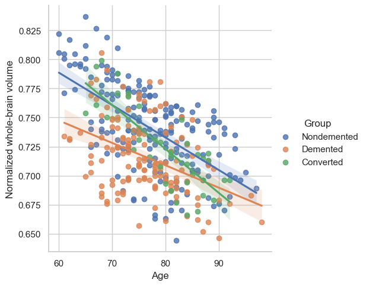
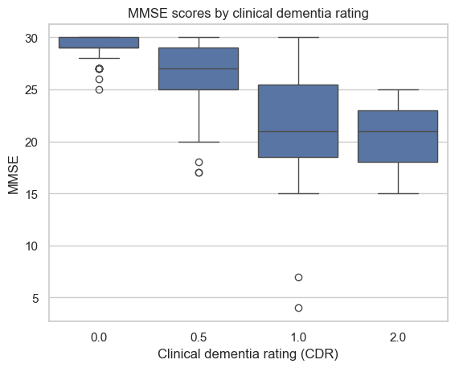
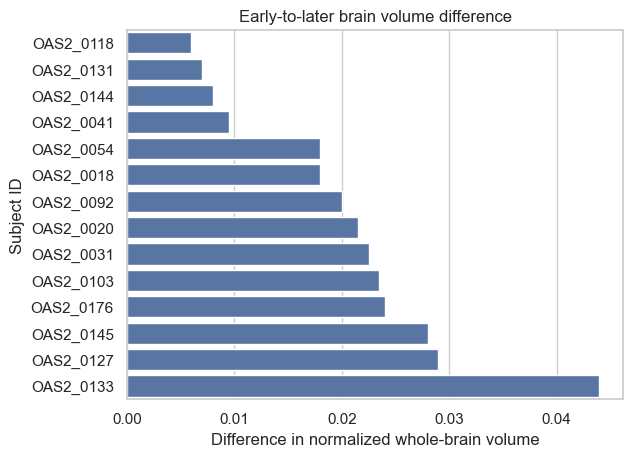

# Cognitive Decline Monitoring — OASIS-2 Longitudinal Analysis

A full-pipeline analytics project examining how demographic and MRI-derived brain measures track with dementia progression, framed as an operations/monitoring question for a memory clinic rather than a diagnostic ML model.

## Business question

Which demographic and MRI-derived brain measures track with dementia progression across visits, and what should a memory clinic's monitoring/intervention protocol look like as a result?

## Dataset

[OASIS-2 Longitudinal MRI Data](https://www.kaggle.com/datasets/nadiatriki/oasis-2-longitudinal-scan-data) (Kaggle: `nadiatriki/oasis-2-longitudinal-scan-data`)

- 150 subjects, aged 60–96 at baseline, each scanned on 2+ visits at least a year apart (373 total imaging sessions)
- 72 subjects nondemented throughout the study; 64 demented at first visit and remained so; 14 converted from nondemented to demented during the study window

Raw and cleaned data files (`data/oasis_longitudinal.csv`, `data/oasis_cleaned.csv`) are small enough to be committed directly — no separate download step needed to reproduce the pipeline.

## Pipeline

This project deliberately spans the full analytics stack rather than stopping at one tool:

1. **Python (pandas, seaborn)** — data cleaning with documented, non-blind decisions (e.g. MMSE nulls dropped at the row level, not the subject level; SES excluded from analysis as an explicit scoping decision, not a data-quality fix), exploratory analysis, and per-subject progression comparisons.
2. **Azure SQL Database** — cleaned data loaded into SQL Server; analytical queries (joins, subqueries, self-joins, window-style aggregations) covering group trends, watch-list flagging, and per-subject decline.
3. **Power BI (Power Query + DAX)** — an interactive dashboard connected via Import, with DAX measures for KPIs, group- and CDR-based comparisons, and a published Power BI Service report.

## Running the notebook

```bash
pip install -r requirements.txt
jupyter notebook eda.ipynb
```

The analysis can also be run as a regular Python script:

```bash
python eda.py
```

The script writes the cleaned dataset to `data/oasis_cleaned.csv` and saves
the analysis plots to `result_plot/`.

## Key findings

**1. A normal exam doesn't always mean a normal memory score.** About 1 in 8 patients with a normal clinical exam (CDR = 0) still scored below the typical range on the memory test (MMSE < 28) — and this shows up at a similar rate in patients who stay healthy and patients who later develop dementia. Brain-volume scans add a piece the memory test misses: structural decline can already be underway while the memory test still looks normal. A clinic could flag this combination for a shorter check-in window rather than waiting for the next scheduled visit.

**2. The memory test stops being useful once someone's already diagnosed.** Patients rated "mild" (CDR 1) and "moderate" (CDR 2) score almost identically on the memory test, with heavily overlapping ranges — confirmed both in the original boxplot analysis and in the dashboard's CDR-level comparison. Past initial diagnosis, tracking progression should rely on clinical rating or structural markers instead of memory test trend.

**3. Brain volume loss is universal after diagnosis, but the pace is very different person to person.** All 14 patients who converted to dementia during the study showed measurable brain-volume decline — but the fastest-declining patient lost volume roughly 7x quicker than the slowest. Supports individualized rather than fixed-interval monitoring.

Full write-up: [`reports/Cognitive_Decline_Monitoring_Stakeholder_Report.pdf`](reports/Cognitive_Decline_Monitoring_Stakeholder_Report.pdf)

### Selected plots







## Dashboard

Three-page Power BI report — Overview (headline KPIs and trends), Population (demographics), Clinical Insights & Risk Indicators (regression, watch-list rate, per-subject decline). Published to Power BI Service; screenshots to be added here.

## Repository structure

```
├── sql/                        # Analytical SQL queries (Azure SQL DB)
├── dashboard/                  # Power BI dashboard (.pbix) and theme
├── data/                       # Raw and cleaned datasets
├── result_plot/                # Key plots referenced in this README
├── reports/                    # Full stakeholder write-up (PDF)
├── eda.ipynb                   # Python cleaning + EDA notebook
├── eda.py                     # Runnable version of the cleaning + EDA pipeline
├── requirements.txt
└── LICENSE
```

## Tools

Python (pandas, seaborn, numpy, matplotlib) · Azure SQL Database · Power BI (Power Query, DAX)

## License

MIT — see [LICENSE](LICENSE).
